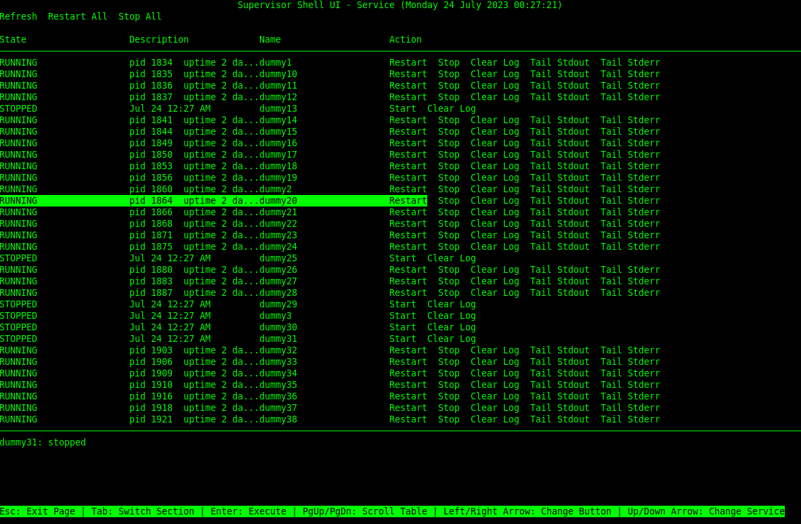

# supervisor-shell-ui

[](https://github.com/psyb0t/supervisor-shell-ui/blob/master/assets/supervisor-shell-ui.png)

supervisor-shell-ui is a command-line interface (CLI) for managing processes using the Supervisor program. Supervisor is a client/server system that allows its users to monitor and control a number of processes on UNIX-like operating systems. This tool provides an alternative to the built-in web interface of Supervisor, offering a more convenient way to manage processes directly from the terminal.

## Table of Contents

- [Features](#features)
- [Prerequisites](#prerequisites)
- [Installation](#installation)
  - [Install from PyPI](#install-from-pypi)
  - [Install from GitHub](#install-from-github)
  - [Install from .tar.gz](#install-from-targz)
- [Usage](#usage)
  - [Keybindings](#keybindings)
- [Important Notes](#important-notes)
- [License](#license)

## Features

- View and manage processes controlled by Supervisor.
- Start, stop, and restart processes.
- View and clear process logs.
- Navigate and interact with the interface using keyboard shortcuts.

## Prerequisites

- Python 3.6 or higher.
- Supervisor program installed on your system.

## Installation

### Install from PyPI

```bash
pip install supervisor-shell-ui
```

### Install from GitHub

You have two ways to install from GitHub.

**First option: clone the repository**

```bash
git clone https://github.com/psyb0t/supervisor-shell-ui.git
cd supervisor-shell-ui
pip install .
```

**Second option: use pip to install directly from GitHub**

```bash
pip install git+https://github.com/psyb0t/supervisor-shell-ui.git#egg=supervisor-shell-ui
```

Both ways will achieve the same result, installing the supervisor-shell-ui package on your system. Choose the one that suits you best.

### Install from .tar.gz

First, download the `.tar.gz` file from the GitHub [releases page](https://github.com/psyb0t/supervisor-shell-ui/releases). Then extract it and navigate to the extracted directory:

```bash
tar -xvzf supervisor-shell-ui.tar.gz
cd supervisor-shell-ui
```

Install using pip:

```bash
pip install .
```

Alternatively, you can also use the `setup.py` file:

```bash
python setup.py install
```

## Usage

After installing, you can run the application with the following command:

```bash
supervisor-shell-ui
```

### Keybindings

- **Esc**: Exit Page
- **Tab**: Switch Section
- **Enter**: Execute
- **Page Up/Down**: Scroll Table
- **Left/Right Arrow**: Change Button
- **Up/Down Arrow**: Change Process

## Important Notes

- This application is intended for use on UNIX-like operating systems.
- The application requires that the Supervisor program is already installed and properly configured on your system.
- supervisor-shell-ui relies on `supervisorctl` under the hood. In order to run it from a non-root user, you will need to set appropriate permissions for the `supervisor.sock` file in the supervisor configuration.

## License

This project is licensed under the terms of the GPL-3.0 license.
